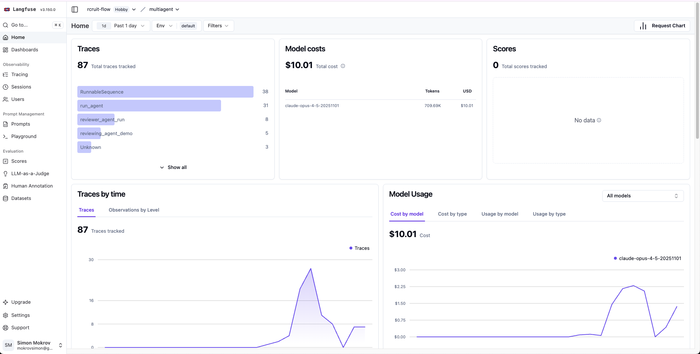
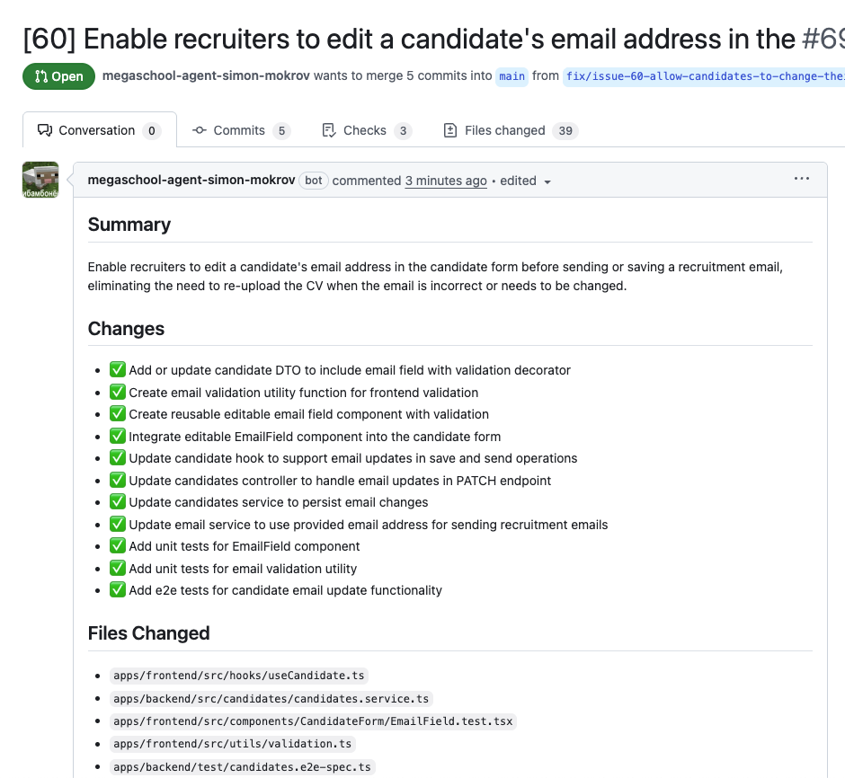
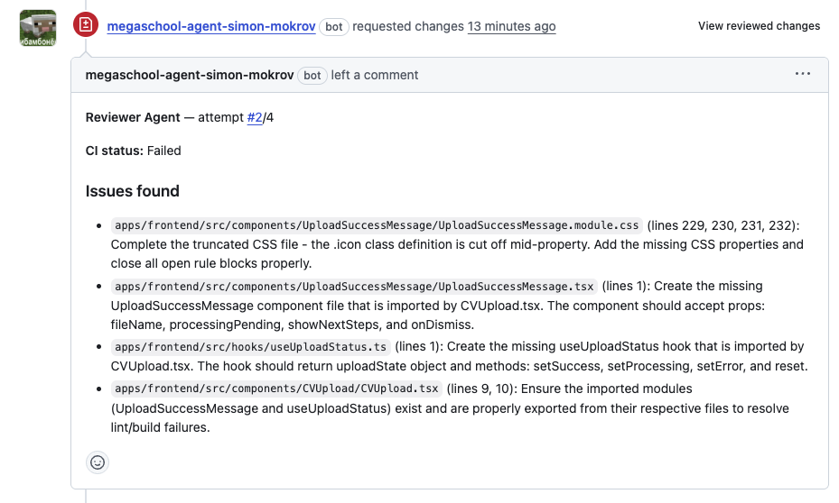

# Development Agent

Мульти-агентная система с микросервисной архитектурой для автоматизации процессов разработки программного обеспечения на GitHub.

## 🔗 Ссылки

- **Тестовый проект**: [RcruitFlow](https://github.com/semwett0301/rcruit-flow) - проект на котором тестировалась система
- **Тестовый стенд**: [rcruit-flow.onrender.com](https://rcruit-flow.onrender.com/) - демо-версия тестового проекта
- **GitHub App**: [megaschool-agent-simon-mokrov](https://github.com/apps/megaschool-agent-simon-mokrov) - итоговое приложение GitHub App

## Scope проекта

Development Agent — это система автоматизации разработки, которая:

- **Автоматически обрабатывает GitHub Issues**: При создании нового issue система анализирует его, создает план действий и генерирует код для решения задачи
- **Создает Pull Request'ы**: После генерации кода система автоматически создает PR с изменениями
- **Проводит автоматический code review**: После завершения CI/CD пайплайнов система анализирует PR, проверяет соответствие требованиям issue и качество кода
- **Интегрируется с GitHub через GitHub App**: Использует GitHub App для аутентификации и работы с репозиториями
- **Использует LLM для генерации кода**: Поддерживает различные провайдеры (Anthropic Claude, OpenAI, Mistral, Yandex GPT)

### Основные возможности

- 📝 Автоматическая обработка GitHub Issues
- 🔍 Поиск релевантного кода в репозитории
- 📋 Создание плана действий на основе issue
- 💻 Генерация кода с учетом контекста проекта
- 🔄 Автоматическое создание PR с изменениями
- ✅ Автоматический code review после CI
- 📊 Мониторинг через Langfuse
- 🔐 Безопасная интеграция через GitHub App

## Environment Variables

Проект использует следующие переменные окружения:

### Kafka (KRaft mode)

```bash
KAFKA_NODE_ID=1
KAFKA_PROCESS_ROLES=broker,controller
KAFKA_CONTROLLER_QUORUM_VOTERS=1@kafka:9093
KAFKA_LISTENERS=PLAINTEXT_INTERNAL://0.0.0.0:29092,PLAINTEXT_EXTERNAL://0.0.0.0:9092,CONTROLLER://0.0.0.0:9093
KAFKA_ADVERTISED_LISTENERS=PLAINTEXT_INTERNAL://kafka:29092,PLAINTEXT_EXTERNAL://localhost:9092
KAFKA_LISTENER_SECURITY_PROTOCOL_MAP=PLAINTEXT_INTERNAL:PLAINTEXT,PLAINTEXT_EXTERNAL:PLAINTEXT,CONTROLLER:PLAINTEXT
KAFKA_CONTROLLER_LISTENER_NAMES=CONTROLLER
KAFKA_INTER_BROKER_LISTENER_NAME=PLAINTEXT_INTERNAL
KAFKA_OFFSETS_TOPIC_REPLICATION_FACTOR=1
```

### Webhook Service

```bash
GITHUB_WEBHOOK_SECRET=your_webhook_secret  # Секрет для верификации webhook'ов от GitHub
KAFKA_BOOTSTRAP_SERVERS=kafka:29092        # Адрес Kafka брокера
```

### LLM Configuration

```bash
# Провайдер: anthropic, openai, mistral, yandex
LLM_PROVIDER=anthropic
LLM_MODEL=claude-opus-4-5-20251101
LLM_MAX_TOKENS=16384
LLM_TEMPERATURE=0.1

# Anthropic (Claude)
ANTHROPIC_API_KEY=your_anthropic_api_key

# OpenAI (альтернатива)
# OPENAI_API_KEY=your_openai_api_key
# LLM_PROVIDER=openai
# LLM_MODEL=gpt-4o-mini

# Mistral AI (альтернатива)
# MISTRAL_API_KEY=your_mistral_api_key
# LLM_PROVIDER=mistral
# LLM_MODEL=mistral-large-latest

# Yandex GPT (альтернатива)
# YANDEX_API_KEY=your_yandex_api_key
# YANDEX_FOLDER_ID=your_folder_id
# LLM_PROVIDER=yandex
# LLM_MODEL=yandexgpt
```

### Langfuse (Observability)

```bash
LANGFUSE_PUBLIC_KEY=your_public_key
LANGFUSE_SECRET_KEY=your_secret_key
LANGFUSE_BASE_URL=https://cloud.langfuse.com
```

### GitHub App

```bash
GITHUB_APP_ID=your_app_id
# Приватный ключ должен быть закодирован в base64: cat private-key.pem | base64 | tr -d '\n'
GITHUB_APP_PRIVATE_KEY=your_base64_encoded_private_key
```

### Docker Hub (для production)

```bash
DOCKERHUB_USERNAME=your_dockerhub_username
```

## Архитектура проекта

Проект построен на микросервисной архитектуре с использованием Kafka для асинхронной коммуникации между сервисами.

### Компоненты системы

```
┌─────────────────┐
│   GitHub App    │
└────────┬────────┘
         │ Webhooks
         ▼
┌─────────────────┐
│ Webhook Service │ ──┐
└─────────────────┘   │
                      │ Kafka Events
                      ▼
              ┌───────────────┐
              │    Kafka      │
              │  (Message     │
              │   Broker)     │
              └───────┬───────┘
                      │
         ┌────────────┴────────────┐
         │                         │
         ▼                         ▼
┌──────────────┐         ┌──────────────┐
│ Coding Agent │         │Reviewer Agent│
│              │         │              │
│ - Issue      │         │ - PR Review  │
│   Analysis   │         │ - CI Check   │
│ - Code       │         │ - Error      │
│   Generation │         │   Detection  │
│ - PR Creation│         │              │
└──────────────┘         └──────────────┘
         │                         │
         └──────────┬──────────────┘
                    │
                    ▼
            ┌──────────────┐
            │   GitHub     │
            │  Repository  │
            └──────────────┘
```

### Сервисы

#### 1. Webhook Service (`webhook-service`)
- **Порт**: `80` (production), `8005` (development)
- **Назначение**: Принимает webhook'и от GitHub и преобразует их в события Kafka
- **Обрабатываемые события**:
  - `issues.opened` → создает `CodingEvent(type="START")` → запускает Coding Agent
  - `pull_request_review` (state="changes_requested") → создает `CodingEvent(type="REDO")` → перезапускает Coding Agent
  - `check_suite.completed` → создает `ReviewEvent` → запускает Reviewer Agent
- **Безопасность**: Верификация подписи webhook'ов через `GITHUB_WEBHOOK_SECRET`

#### 2. Coding Agent (`coding-agent`)
- **Порт**: `8080` (production), `8001` (development)
- **Назначение**: Основной агент для генерации кода на основе GitHub Issues
- **Workflow**:
  1. Получение и анализ issue
  2. Поиск релевантного кода в репозитории
  3. Создание плана действий
  4. Генерация кода по шагам плана
  5. Коммит изменений
  6. Создание Pull Request
- **Особенности**:
  - Использует LLM для понимания задачи и генерации кода
  - Анализирует структуру проекта и код-конвенции
  - Поддерживает Docker-in-Docker для валидации кода

#### 3. Reviewer Agent (`reviewer-agent`)
- **Порт**: `8081` (production), `8004` (development)
- **Назначение**: Автоматический code review после завершения CI/CD
- **Workflow**:
  1. Получение PR и связанного issue
  2. Анализ diff'а изменений
  3. Проверка соответствия требованиям issue
  4. Проверка статуса CI/CD пайплайнов
  5. Поиск ошибок и проблем в коде
  6. Создание комментариев в PR
- **Особенности**:
  - Использует embedding для сравнения summary issue и PR
  - Проверяет прохождение CI/CD
  - Может перезапускать процесс до 4 раз при обнаружении проблем

#### 4. Kafka
- **Порт**: `9092`
- **Назначение**: Message broker для асинхронной коммуникации между сервисами
- **Топики**:
  - `coding-events`: События для запуска Coding Agent
  - `review-events`: События для запуска Reviewer Agent
- **Режим**: KRaft (без Zookeeper)

### Поток данных и сообщений

#### Схема потока сообщений через Kafka

Система использует асинхронную коммуникацию через Kafka для координации работы агентов. Ниже представлена детальная схема потока сообщений:

```
GitHub Webhooks
      │
      ├─ issues.opened
      │     │
      │     ▼
      │  Webhook Service
      │     │
      │     │ Верификация подписи webhook'а
      │     │ Извлечение repository и issue_number
      │     │ Создает CodingEvent(type="START", repository, issue_number)
      │     │
      │     ▼
      │  Kafka Topic: coding-events
      │     │
      │     ▼
      │  Coding Agent (Consumer, group_id: "coding-agent")
      │     │
      │     ├─ Получает issue через GitHub API
      │     ├─ Анализирует issue и создает план действий
      │     ├─ Ищет релевантный код в репозитории
      │     ├─ Генерирует код по шагам плана
      │     ├─ Создает коммит с изменениями
      │     └─ Создает Pull Request
      │           │
      │           ▼
      │        GitHub Repository
      │           │
      │           ├─ Запускает CI/CD пайплайны
      │           │
      │           └─ После завершения → check_suite.completed
      │
      ├─ pull_request_review (action="submitted", state="changes_requested")
      │     │
      │     ▼
      │  Webhook Service
      │     │
      │     │ Верификация подписи webhook'а
      │     │ Извлечение PR и связанного issue из PR body (Closes #N)
      │     │ Создает CodingEvent(type="REDO", repository, issue_number, pull_request_number)
      │     │
      │     ▼
      │  Kafka Topic: coding-events
      │     │
      │     ▼
      │  Coding Agent (Consumer, group_id: "coding-agent")
      │     │
      │     ├─ Получает существующий PR
      │     ├─ Анализирует комментарии ревьюера
      │     ├─ Генерирует исправления кода
      │     ├─ Создает новый коммит
      │     └─ Обновляет существующий PR
      │           │
      │           ▼
      │        GitHub Repository
      │           │
      │           └─ Запускает CI/CD пайплайны → check_suite.completed
      │
      └─ check_suite.completed (action="completed")
            │
            ▼
         Webhook Service
            │
            │ Верификация подписи webhook'а
            │ Извлечение всех PR, связанных с check_suite
            │ Для каждого PR создает ReviewEvent(repository, pull_request_number)
            │
            ▼
         Kafka Topic: review-events
            │
            ▼
         Reviewer Agent (Consumer, group_id: "reviewer-agent")
            │
            ├─ Получает PR через GitHub API
            ├─ Извлекает номер issue из PR body (Closes #N)
            ├─ Получает issue через GitHub API
            ├─ Анализирует diff изменений в PR
            ├─ Проверяет статус CI/CD пайплайнов (check_runs)
            ├─ Сравнивает summary issue и PR (через embedding)
            ├─ Ищет ошибки и проблемы в коде через LLM
            ├─ Формирует результат ревью
            └─ Создает комментарий в PR (при обнаружении проблем)
                  │
                  ▼
               GitHub Repository
```

#### Типы событий Kafka

##### 1. CodingEvent (Топик: `coding-events`)

События для запуска или перезапуска Coding Agent.

**Типы событий:**
- `START` - Начало обработки нового issue
- `REDO` - Перезапуск обработки существующего issue/PR

**Структура сообщения:**
```json
{
  "type": "START" | "REDO",
  "repository": "owner/repo-name",
  "issue_number": 123,
  "pull_request_number": 456  // Опционально, только для REDO
}
```

**Источники событий:**
- `issues.opened` → `START` - При создании нового issue. Webhook Service извлекает `repository` и `issue_number` из payload и создает событие `START`.
- `pull_request_review` (action="submitted", state="changes_requested") → `REDO` - При запросе изменений в review. Webhook Service извлекает номер issue из PR body (ищет паттерн "Closes #N" или "Fixes #N") и создает событие `REDO` с `pull_request_number`.

**Consumer:** Coding Agent (group_id: `coding-agent`)

##### 2. ReviewEvent (Топик: `review-events`)

События для запуска Reviewer Agent после завершения CI/CD.

**Структура сообщения:**
```json
{
  "repository": "owner/repo-name",
  "pull_request_number": 456
}
```

**Источники событий:**
- `check_suite.completed` - После завершения CI/CD пайплайнов

**Consumer:** Reviewer Agent (group_id: `reviewer-agent`)

#### Детальный поток обработки

**Сценарий 1: Обработка нового Issue**

1. Пользователь создает Issue в GitHub
2. GitHub отправляет webhook `issues.opened` на `/github/webhook/`
3. Webhook Service:
   - Верифицирует подпись webhook'а
   - Извлекает `repository` и `issue_number` из payload
   - Создает `CodingEvent(type="START", repository, issue_number)`
   - Отправляет событие в топик `coding-events` Kafka
4. Coding Agent (consumer):
   - Получает событие из топика `coding-events`
   - Получает issue через GitHub API
   - Анализирует issue и создает план действий
   - Генерирует код
   - Создает коммит и Push Request
5. GitHub запускает CI/CD пайплайны для нового PR
6. После завершения CI/CD GitHub отправляет webhook `check_suite.completed`
7. Webhook Service создает `ReviewEvent` и отправляет в топик `review-events`
8. Reviewer Agent анализирует PR и создает комментарии

**Сценарий 2: Перезапуск обработки (REDO)**

1. Ревьюер запрашивает изменения в PR (оставляет review с state="changes_requested")
2. GitHub отправляет webhook `pull_request_review` с action="submitted" и state="changes_requested"
3. Webhook Service:
   - Верифицирует подпись webhook'а
   - Извлекает `repository` и `pull_request_number` из payload
   - Извлекает номер issue из PR body (ищет паттерн "Closes #N", "Fixes #N" или использует номер PR как fallback)
   - Создает `CodingEvent(type="REDO", repository, issue_number, pull_request_number)`
   - Отправляет событие в топик `coding-events` Kafka
4. Coding Agent (consumer):
   - Получает событие из топика `coding-events`
   - Получает существующий PR через GitHub API
   - Анализирует комментарии ревьюера из PR
   - Генерирует исправления кода
   - Создает новый коммит с исправлениями
   - Обновляет существующий PR новым коммитом
5. GitHub запускает CI/CD пайплайны для обновленного PR
6. После завершения CI/CD цикл повторяется с шага 6 основного сценария (запуск Reviewer Agent)


## Deployment

### Инфраструктура

Система развернута на виртуальной машине в облаке с использованием Docker Compose.

### GitHub Actions CI/CD

Проект использует GitHub Actions для автоматической сборки и деплоймента:

1. **CI Pipeline** (при каждом push/PR):
   - Линтинг кода (pylint)
   - Запуск тестов (pytest)
   - Сборка Docker образов для каждого сервиса

2. **CD Pipeline** (при push в main):
   - Сборка и push образов в Docker Hub
   - SSH подключение к production серверу
   - Обновление docker-compose.yml из репозитория
   - Pull новых образов
   - Перезапуск сервисов

### Настройка GitHub App

1. Создайте GitHub App в настройках организации/репозитория
2. Настройте webhook URL: `https://your-domain.com/github/webhook/`
3. Выдайте следующие permissions:
   - Repository permissions:
     - Contents: Read & Write
     - Issues: Read & Write
     - Pull requests: Read & Write
     - Metadata: Read-only
   - Webhook events:
     - Issues (для обработки `issues.opened`)
     - Pull request reviews (для обработки `pull_request_review` с state="changes_requested")
     - Check suite (для обработки `check_suite.completed`)
4. Установите App в нужные репозитории
5. Сохраните App ID и сгенерируйте приватный ключ
6. Закодируйте приватный ключ в base64: `cat private-key.pem | base64 | tr -d '\n'`

### Production Deployment

```bash
# На production сервере
cd /path/to/deployment
docker compose down
curl -sL https://raw.githubusercontent.com/your-org/development-agent/main/docker-compose.prod.yml -o docker-compose.yml
docker compose pull
docker compose up -d
```

### Переменные окружения для production

Все переменные окружения должны быть настроены в `.env` файле на production сервере. Используйте `.env.example` как шаблон.

## Langfuse Integration

Проект интегрирован с Langfuse для мониторинга и observability LLM вызовов. Система отслеживает все взаимодействия с LLM моделями, предоставляя детальную аналитику по использованию, стоимости и производительности.

### Возможности

- 📊 Трекинг всех LLM запросов и ответов
- 🔍 Анализ производительности промптов
- 💰 Мониторинг стоимости использования LLM
- 📈 Метрики качества и успешности выполнения
- 🔗 Трассировка выполнения агентов

### Настройка

1. Создайте аккаунт на [Langfuse Cloud](https://cloud.langfuse.com)
2. Получите Public Key и Secret Key
3. Настройте переменные окружения:
   ```bash
   LANGFUSE_PUBLIC_KEY=your_public_key
   LANGFUSE_SECRET_KEY=your_secret_key
   LANGFUSE_BASE_URL=https://cloud.langfuse.com
   ```

### Langfuse Dashboard

Ниже представлен дашборд Langfuse для организации **rcruit-flow**, демонстрирующий метрики работы системы:



*Дашборд Langfuse для проекта rcruit-flow: общее количество traces (87), стоимость использования модели Claude Opus ($10.01), графики использования и стоимости по времени*

## Демонстрация

### Пример работы системы

#### 1. Создание Issue

Создайте issue в GitHub репозитории с описанием задачи:

```
Добавить функцию валидации email адресов в модуль utils
```

#### 2. Автоматическая обработка

- ✅ Coding Agent получает событие через webhook
- ✅ Анализирует issue и создает план действий
- ✅ Генерирует код с учетом контекста проекта
- ✅ Создает Pull Request с изменениями

**Пример созданного Pull Request:**



*Пример автоматически созданного PR ботом `megaschool-agent-simon-mokrov` для issue #69. PR содержит детальное описание изменений, список выполненных задач и измененные файлы.*

#### 3. Code Review

- ✅ После завершения CI/CD запускается Reviewer Agent
- ✅ Проверяется соответствие требованиям issue
- ✅ Анализируется качество кода
- ✅ Создаются комментарии в PR при обнаружении проблем

**Пример автоматического code review:**



*Пример комментария Reviewer Agent в PR. Агент анализирует код, проверяет статус CI/CD и выявляет проблемы: неполные файлы, отсутствующие компоненты, ошибки импорта. При обнаружении проблем агент запрашивает изменения и может перезапустить процесс генерации кода.*

### Основные возможности в действии

- 🎯 **Точное понимание задачи**: Агент анализирует issue и создает детальный план
- 🔍 **Контекстная генерация**: Код генерируется с учетом существующей кодовой базы
- ✅ **Автоматическая валидация**: Проверка кода через Docker-in-Docker
- 📝 **Качественные PR**: Автоматически создаются информативные Pull Request'ы
- 🔄 **Итеративное улучшение**: Возможность перезапуска при необходимости

## Пробелы и лимиты

### Текущие ограничения

1. **Отсутствие поддержки линтеров и тестов**: Coding Agent не интегрирован с линтерами и тестовыми утилитами проекта. Генерируемый код не проходит автоматическую проверку на соответствие стандартам кодирования и не запускает тесты перед созданием PR.

2. **Отсутствие векторной индексации**: Система не использует векторную базу данных для индексации кода. Поиск релевантного контекста осуществляется через простой текстовый поиск, что может быть менее эффективно для больших репозиториев.

3. **Требование публичного репозитория**: Система работает только с публичными GitHub репозиториями. Приватные репозитории не поддерживаются.

4. **Зависимость от CI/CD пайплайнов**: Reviewer Agent работает только если в репозитории настроены CI/CD пайплайны (GitHub Actions). Без пайплайнов автоматический code review не запускается.

### Дополнительные ограничения

- **Размер репозитория**: Большие репозитории (>100MB) могут вызывать проблемы с производительностью. Ограничения токенов LLM могут не позволить обработать весь контекст.

- **Сложность задач**: Система лучше справляется с четко определенными задачами. Многошаговые задачи могут требовать нескольких итераций.


### Планы на будущее

- [ ] Интеграция с линтерами и тестовыми фреймворками проекта
- [ ] Добавление векторной базы данных для улучшенного поиска по контексту
- [ ] Поддержка приватных репозиториев
- [ ] Работа без обязательного наличия CI/CD пайплайнов


## Getting Started

### Prerequisites

- Python 3.12+
- Docker & Docker Compose

### Setup

```bash
cp .env.example .env
# Заполните .env файл необходимыми переменными
make setup
docker compose up -d
```

### Commit Convention

Этот проект следует спецификации [Conventional Commits](https://www.conventionalcommits.org/).

**Формат**: `<type>(<scope>): <subject>`

**Типы**:
- `feat`: Новая функциональность
- `fix`: Исправление бага
- `chore`: Задачи по поддержке (зависимости, CI, конфиги)
- `refactor`: Изменение кода без исправления бага или добавления функции

**Scopes**: `coding`, `reviewer`, `webhook`
